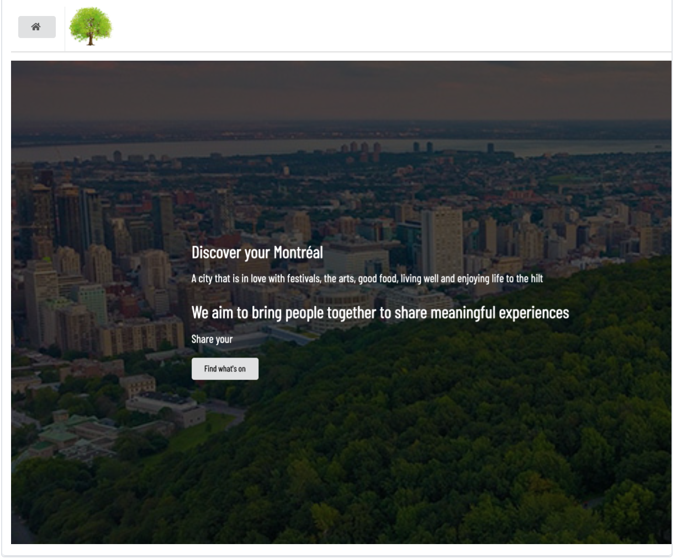
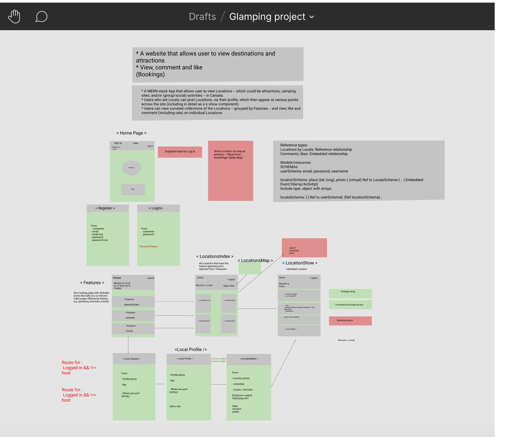
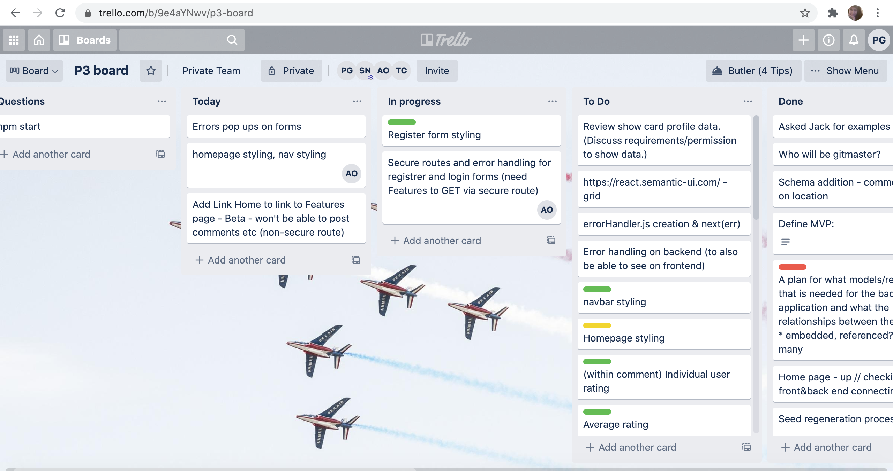

# Discover your Montreal
A full-stack MERN app with multiple relationships and CRUD functionality. It allows users to add, comment, like, rate, and share their choice of destination, around the city of Montreal.

 
 
# Timeframe:
9 days
# Goal
Build a full-stack react app as a group using Node.js, Express, and MongoDB.
# Project Team:
* Simon Neil: https://github.com/Simon994
* Teresa Clark: https://github.com/TClark000
* Anouska Ralph: https://github.com/AnouskaRalph
# Technologies:
* React.js
* Node.js
* MongoDB/Mongoose
* Express
* Css
* Semantic UI React
* Nodemon
* Axios
* React Mapbox GL
* Jsonwebtoken
* Bcrypt
* HTTP-proxy-middleware
* GIT and GitHub
# Installation:
```
# Install dependencies
 
npm install
# Start the database
 
mongod --dbpath ~/data/db
 
# Run Seeding the fake database
 
npm run seed
 
This will seed the database using the file at ./db/seeds.js, which uses a small number of user data that we have provided.
 
npm run seedexternal
 
This will seed the database using the file at ./db/seedexternal.js, which uses faker (https://www.npmjs.com/package/faker) to populate the database with the user data.
 
# Start the backend server
 
npm run dev
 
# Navigate the /frontend directory
 
cd frontend
 
# Install frontend dependencies
 
npm install
 
# Start the frontend site
 
npm start
 
Navigate in your browser to localhost:4000/. While the server is running you should see the frontend being served by database to the browser.
```
# Wireframes:
We utilised wireframes on Figma to guide the MVP and Trello for managing progress. As a team of four, we split the tasks, sometimes working individually and sometimes pair coding.
Working on a group project creating a wireframe was really important to make sure we were all working to the same goal.

# Planning:

# Process
We had a stand up every morning and looked at our trello board creating a list of the days tasks and reviewing the previous days achievements. This structure meant that we kept to the time schedule and also celebrate the small wins of the previous day.
We also checked in throughout the day if were done with a certain task and were moving onto the next - this meant that we would have fewer Github conflicts.

# Development process
Backend - Seeding
```
mongoose.connect(
 dbURI,
 { useNewUrlParser: true, useCreateIndex: true, useUnifiedTopology: true },
 async (err, db) => { // db gives a persistent connection to db
   if (err){
     console.log(err)
     return
   }
 
   try {
     await mongoose.connection.db.dropDatabase() //delete db data
     console.log('Database dropped')
 
     const users = await User.create(userData)
     console.log(`${users.length} users created`)
 
     const locationWithUsers = locationData.map(location => {
       location.local = users[(Math.floor(Math.random() * (users.length - 1)))]._id
       return location
     })
     const locations = await Location.create(locationWithUsers)
     console.log(`${locations.length} locations created`)
    
     const commentWithUsers = commentData.map(comment => {
       comment.local = users[(Math.floor(Math.random() * (users.length - 1)))]._id
       return comment
     })
     for (let index = 0; index < commentWithUsers.length; index++){
       const random = Math.floor(Math.random() * (locations.length - 1))
       const location = await Location.findOne().skip(random)
       const locationById = await Location.findById(location._id)
       await locationById.comments.push(commentWithUsers[index])
       await locationById.save()
     }
     console.log(`${commentWithUsers.length} comments created`)
     // const locationsResult = await Location.find()
     // locationsResult.forEach(location => {
     //   console.log(location.placeName, 'comments: ', location.comments)
     // })
  
   } catch (err) {
     console.log(err)
     return
   }
  
   await mongoose.connection.close()
 }
)
```
Fake data was useful when building and testing our application. Seedexternal fake data of fake users.
```
mongoose.connect(
 dbURI, { useNewUrlParser: true, useUnifiedTopology: true, useCreateIndex: true },
 async (err) => {
  
   if (err) return console.log(err) // ! Any error in connection will log here
 
   try {
    
     await mongoose.connection.db.dropDatabase()
 
     console.log('🚨 Database dropped 🚨')
 
     const users = [] // ! an array to push my 100 fake users into
     /* const randomBoolean = () => {
       return Math.random() >= 0.6
     } */
     for (let index = 0; index < 100; index++) { // ! looping to create 300 users
       const username = faker.internet.userName() // ! generating a fake username
       const firstName = faker.name.firstName() // ! A fake first name
       const lastName = faker.name.lastName() // ! A fake last name
       const email = `${firstName}.${lastName}@email.com` // ! concatenating them together to make the email
       const userimage = `${faker.image.imageUrl()}?random=${Date.now()}`  // ! and a fake profile image
       const password = faker.internet.password()
       const bio = faker.lorem.paragraph()
       // const isLocal = randomBoolean()
       const userTelephone = faker.phone.phoneNumber()
 
       users.push({
         username,
         email,
         userimage,
         password, // ! setting all the passwords the same
         passwordConfirmation: password,
         bio,
         // isLocal,
         userTelephone
       })
     }
    
    
     const createdUsers = await User.create(users) // ! then pass that users array
     console.log(createdUsers)
     console.log(`❇️ ${createdUsers.length} users created ❇️`)
    
     const locationWithUsers = locationData.map(location => {  // create location
       location.local = createdUsers[(Math.floor(Math.random() * (createdUsers.length - 1)))]._id
       return location
     })
     const locations = await Location.create(locationWithUsers)
     console.log(`❇️ ${locations.length} locations created ❇️ `)
 
     const commentWithUsers = commentData.map(comment => {
       comment.local = createdUsers[(Math.floor(Math.random() * (createdUsers.length - 1)))]._id
       return comment
     })
     for (let index = 0; index < commentWithUsers.length; index++){
       const random = Math.floor(Math.random() * (locations.length - 1))
       const location = await Location.findOne().skip(random)
       const locationById = await Location.findById(location._id)
       await locationById.comments.push(commentWithUsers[index])
       await locationById.save()
     }
     console.log(`❇️ ${commentWithUsers.length} comments created ❇️`)
 
     await mongoose.connection.close()
     console.log('👋 Goodbye')
 
   } catch (err) {
     console.log(err) // ! Log any errors that occurs
     await mongoose.connection.close()
     console.log('😬sorry')
   }
 }
)
 
```
# Challenges
Using semantic UI react for styling was really challenging because it was difficult to style and target the one component.

# Wins
Working on a team and communicating regular tasks, solving issues together, pair-coding was a great win.
 
# Future Development
 
Need smooth functionalities on profile page i.e rating and comment adding section.

# Key Learnings
Working in a team was a great experience. Learn so much from every single teammate. Having different ideas but working together to achieve the same goal and trying every idea was tremendous.

