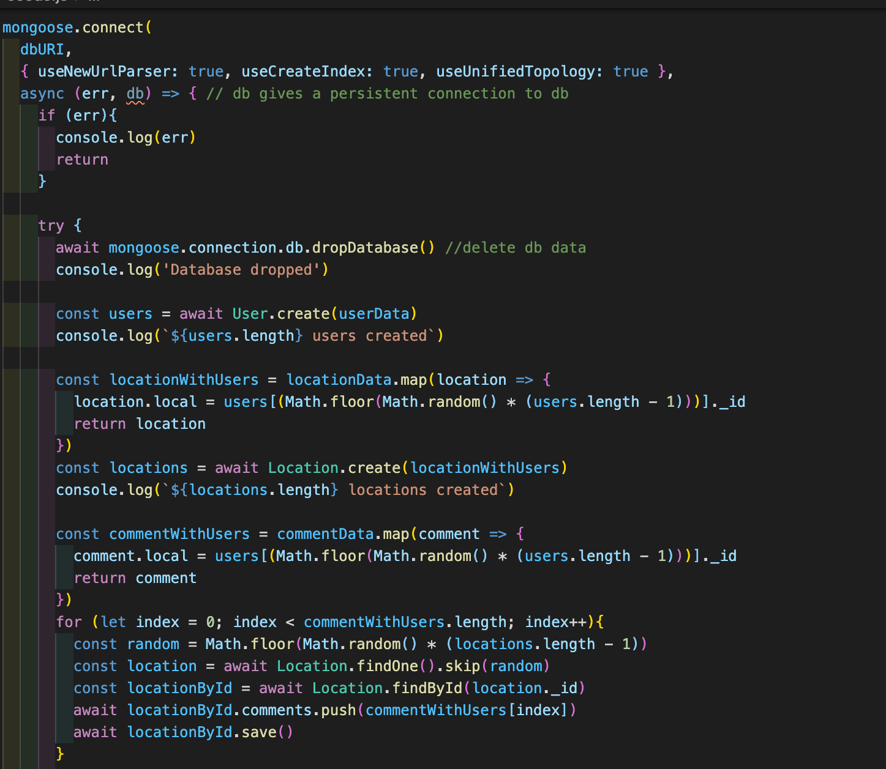
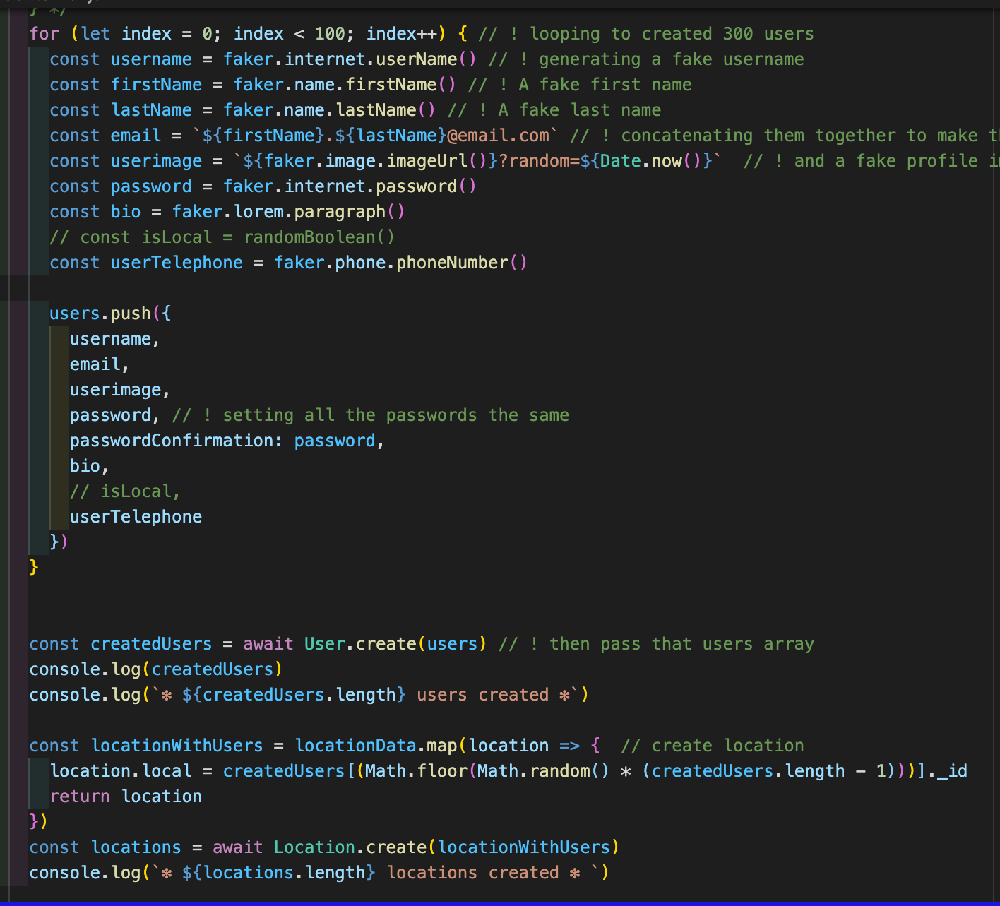

# Project Team:
* Simon Neil: https://github.com/Simon994
* Teresa Clark: https://github.com/TClark000
* Anouska Ralph: https://github.com/AnouskaRalph
 
# Goal
Build a full-stack react app as a group using Node.js, Express, and MongoDB.
 
# Timeframe:
9 days
 
# Technologies:
* React.js
* Node.js
* MongoDB/Mongoose
* Express
* Css
* Semantic UI React
* Nodemon
* Axios
* React Mapbox GL
* Jsonwebtoken
* Bcrypt
* HTTP-proxy-middleware
* GIT and GitHub
 
 
# Discover your Montreal
 
A full-stack MERN app with multiple relationships and CRUD functionality. It allows users to add, comment, like, rate, and share their choice of destination, around the city of Montreal.
 

 
 
# Installation:
 
* Install dependencies: run npm i in Terminal
 
* Start the database: run mongod --dbpath ~/data/db in Terminal
 
* Seed the database either via:
 
 * running npm run seed in Terminal. This will seed the database using the file at ./db/seeds.js, which uses a small number of user data that we have provided.
 
 * running npm run seedexternal in Terminal. This will seed the database using the file at ./db/seedexternal.js, which uses faker (https://www.npmjs.com/package/faker) to populate the database with the user data.
 
* Start the backend server: run npm run dev
 
* Navigate in your browser to localhost:4000/. You should see the frontend being served to the browser.
 
# Wireframes:
 

 
# Planning:
 

 
 
# Process
Backend - Seeding
 

 
Fake data was useful when building and testing our application. Seedexternal fake data of fakeusers.

 
 
# Challenges
Using semantic UI react for styling was really challenging because it was difficult to style and target the one component.
 
# Wins
Working on a team and communicating regular tasks, solving issues together, pair-coding was a great win.
